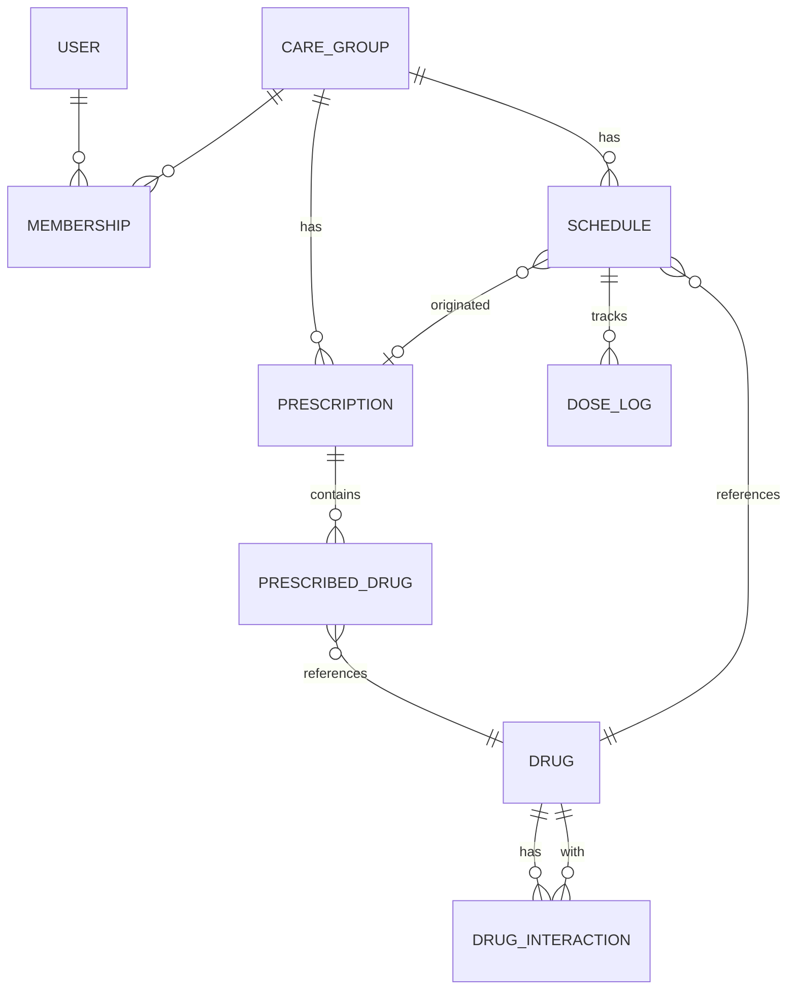

# PillMate ERD

DDD Aggregate 경계를 점선으로 표시. Aggregate 간은 **ID 참조**.

## 전체 다이어그램 (Mermaid)



## Aggregate 경계

### CareGroup Aggregate
```
CareGroup (Root)
├── Membership (Entity)
└── InviteCode (ValueObject)

  속성: id, name, createdAt
```

### Prescription Aggregate
```
Prescription (Root)
├── PrescribedDrug (Entity)        -- drug_id로 Drug 참조 (ID만)
└── PrescriptionImage (ValueObject) -- S3 키만 저장

  속성: id, careGroupId, patientId, prescribedAt, imageKey
```

### Drug Aggregate (식약처 마스터)
```
Drug (Root)
├── Ingredient (ValueObject)
├── Efficacy (ValueObject)
└── SideEffect (ValueObject)

  속성: id, kdCode, name, formulation, source, version
```

### Schedule Aggregate
```
Schedule (Root)
├── DoseTime (ValueObject)
├── Frequency (ValueObject)
└── DateRange (ValueObject)

  속성: id, careGroupId, patientId, drugId, prescriptionId(nullable)
```

### DoseLog Aggregate (큰 볼륨 — 별도 파티션)
```
DoseLog (Root)
└── DoseStatus (ValueObject: PENDING/TAKEN/SKIPPED/DELAYED/MISSED)

  속성: id, scheduleId, patientId, scheduledAt, status, checkedAt, checkedByUserId
  파티셔닝: scheduled_at 월 단위
```

### DrugInteraction Aggregate
```
DrugInteraction (Root)
└── Severity (ValueObject)

  속성: id, drugCodes[], type, severity, source, version
```

## Bounded Context 매핑

| Context | Aggregate(s) |
|---------|-------------|
| user | User |
| caregroup | CareGroup |
| prescription | Prescription |
| drug | Drug, DrugInteraction |
| schedule | Schedule |
| doselog | DoseLog |

## 참조

- `agents/ddd-modeler.md`
- `contexts/ubiquitous-language.md`
