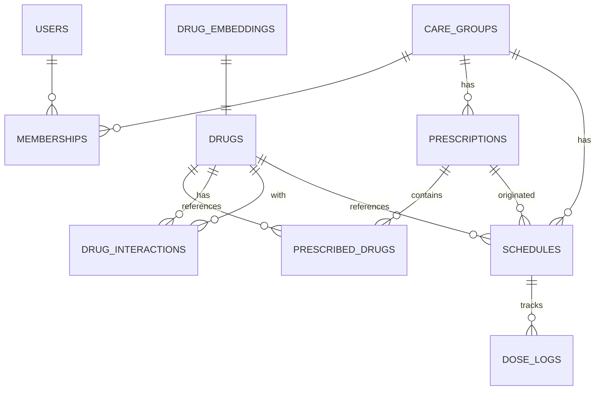

# PillMate Phase 1 (MVP) Design Document

> **Summary**: 보호자 ↔ 노인/환자 그룹 기반 스마트 복약 관리 플랫폼 MVP — 처방전 OCR, RAG 챗봇, 복약 스케줄, 복용 체크 7가지 기능 구현
>
> **Project**: PillMate
> **Author**: 최경영
> **Date**: 2026-05-21
> **Status**: Draft
> **Planning Doc**: [PillMate-Phase1.plan.md](../../01-plan/features/PillMate-Phase1.plan.md)

---

## 1. Overview

### 1.1 Design Goals

1. **TDD 우선**: 모든 도메인/유스케이스는 RED → GREEN → REFACTOR 사이클로 구현
2. **DDD 레이어드**: Bounded Context × 4-Layer (presentation/application/domain/infrastructure)로 의존성 방향 엄격 강제
3. **의료 안전**: 모든 약 정보는 식약처 DB 검증 + 출처 명시 필수
4. **단순함 유지**: Phase 1은 단일 서버. MSA/Kafka는 Phase 3/4

### 1.2 Design Principles

- **Aggregate Root 통한 접근**: 자식 Entity는 Root를 통해서만 접근
- **ID 참조 원칙**: Bounded Context 간 객체 직접 참조 금지, ID만 전달
- **출처 강제**: 모든 LLM 의료 응답에 "식약처" 출처 포함
- **약 데이터 전략**: 식약처 API는 초기 일괄 적재 + 주 1회 delta만. 운영 조회는 내부 DB만

---

## 2. Architecture

### 2.1 시스템 구성도

```
클라이언트 (앱/웹)
       │
       │ HTTPS
       ▼
┌──────────────────────────────────────┐
│  Spring Boot 3 (단일 서버, :8080)   │
│                                      │
│  ┌─────────────────────────────┐     │
│  │  presentation (Controller)  │     │
│  ├─────────────────────────────┤     │
│  │  application (UseCase)      │     │
│  ├─────────────────────────────┤     │
│  │  domain (Entity/VO/Repo)    │     │
│  ├─────────────────────────────┤     │
│  │  infrastructure (JPA/HTTP)  │     │
│  └─────────────────────────────┘     │
└───────────┬──────────────────────────┘
            │ HTTP (내부)
            ▼
┌──────────────────────────────────────┐
│  FastAPI (AI 서버, :8000)           │
│  - OCR (Gemini Vision)              │
│  - RAG 챗봇 (LangChain + pgvector)  │
│  - 건강 추천 / 복약 리포트           │
└───────────┬──────────────────────────┘
            │
  ┌─────────┼──────────┐
  ▼         ▼          ▼
PostgreSQL  Redis      AWS S3
+ pgvector  (캐싱)    (처방전 이미지)
```

### 2.2 Bounded Context 의존 관계

```
caregroup ←── prescription ←── schedule ←── doselog
    │               │
    │            drug (마스터, 식약처 일괄 적재)
    │
   user (Phase 1: 더미, Phase 1 후반: 실제 SSO)
```

- 모든 Context는 ID 참조만 허용
- 공유 데이터(`common/`)는 예외/응답 포맷 등 최소한

### 2.3 DDD 레이어 × Bounded Context 폴더 구조

```
src/main/java/com/pillmate/
├── caregroup/
│   ├── presentation/     CareGroupController, InviteController
│   ├── application/      CreateCareGroupUseCase, JoinGroupUseCase
│   │   └── port/         CareGroupRepository (인터페이스 노출)
│   ├── domain/
│   │   ├── model/        CareGroup, Membership, InviteCode
│   │   ├── repository/   CareGroupRepository (인터페이스)
│   │   └── service/      InviteCodeGenerator
│   └── infrastructure/
│       ├── persistence/  CareGroupJpaRepository, MembershipJpaEntity
│       └── external/     QrCodeAdapter
│
├── prescription/
│   ├── presentation/     PrescriptionController
│   ├── application/      RegisterPrescriptionUseCase, GetPrescriptionUseCase
│   ├── domain/
│   │   ├── model/        Prescription, PrescribedDrug
│   │   ├── repository/   PrescriptionRepository
│   │   └── service/      DrugMatchingService (pgvector 유사도)
│   └── infrastructure/
│       ├── persistence/  PrescriptionJpaRepository
│       ├── external/     OcrFastApiAdapter (FastAPI HTTP), S3Adapter
│       └── cache/        OcrResultCacheAdapter (Redis 해시 캐시)
│
├── drug/
│   ├── presentation/     DrugController
│   ├── application/      SearchDrugUseCase, GetDrugDetailUseCase
│   ├── domain/
│   │   ├── model/        Drug, DrugInteraction
│   │   └── repository/   DrugRepository, DrugInteractionRepository
│   └── infrastructure/
│       ├── persistence/  DrugJpaRepository
│       └── cache/        DrugCacheAdapter (Redis)
│
├── schedule/
│   ├── presentation/     ScheduleController
│   ├── application/      CreateScheduleUseCase, UpdateScheduleUseCase
│   ├── domain/
│   │   ├── model/        Schedule, TimeOfDay, DoseTime, DateRange
│   │   ├── repository/   ScheduleRepository
│   │   └── service/      ScheduleConflictChecker
│   └── infrastructure/
│       └── persistence/  ScheduleJpaRepository
│
├── doselog/
│   ├── presentation/     DoseLogController
│   ├── application/      CheckDoseUseCase, GetDoseHistoryUseCase
│   ├── domain/
│   │   ├── model/        DoseLog, DoseStatus
│   │   ├── repository/   DoseLogRepository
│   │   └── service/      DoseStatisticsService
│   └── infrastructure/
│       └── persistence/  DoseLogJpaRepository (월 파티션)
│
└── common/
    ├── exception/        PillmateException, GlobalExceptionHandler
    ├── response/         ApiResponse<T>, ErrorResponse
    └── security/         JwtProvider, SecurityConfig (Phase 1: 더미)

src/test/java/com/pillmate/
└── (동일 구조 — 각 레이어별 테스트)
```

---

## 3. Data Model (ERD)

### 3.1 전체 ERD



### 3.2 테이블 DDL

#### users
```sql
CREATE TABLE users (
    id           BIGSERIAL PRIMARY KEY,
    external_id  VARCHAR(100) UNIQUE,          -- 카카오/구글 ID (Phase 1: 더미)
    provider     VARCHAR(20),                  -- KAKAO | GOOGLE | DUMMY
    name         VARCHAR(100) NOT NULL,
    email        VARCHAR(200),
    profile_url  VARCHAR(500),
    created_at   TIMESTAMPTZ NOT NULL DEFAULT NOW(),
    updated_at   TIMESTAMPTZ NOT NULL DEFAULT NOW()
);
```

#### care_groups
```sql
CREATE TABLE care_groups (
    id          BIGSERIAL PRIMARY KEY,
    name        VARCHAR(100) NOT NULL,
    created_by  BIGINT NOT NULL,               -- user_id (생성자)
    created_at  TIMESTAMPTZ NOT NULL DEFAULT NOW(),
    updated_at  TIMESTAMPTZ NOT NULL DEFAULT NOW()
);
```

#### memberships (CareGroup ↔ User N:N)
```sql
CREATE TABLE memberships (
    id            BIGSERIAL PRIMARY KEY,
    care_group_id BIGINT NOT NULL REFERENCES care_groups(id),
    user_id       BIGINT NOT NULL REFERENCES users(id),
    role          VARCHAR(20) NOT NULL CHECK (role IN ('ADMIN','GUARDIAN','PATIENT')),
    invited_by    BIGINT,                      -- user_id
    joined_at     TIMESTAMPTZ NOT NULL DEFAULT NOW(),
    UNIQUE (care_group_id, user_id)
);
CREATE INDEX idx_memberships_user   ON memberships (user_id);
CREATE INDEX idx_memberships_group  ON memberships (care_group_id);
```

#### invite_codes
```sql
CREATE TABLE invite_codes (
    id            BIGSERIAL PRIMARY KEY,
    care_group_id BIGINT NOT NULL REFERENCES care_groups(id),
    code          VARCHAR(6) UNIQUE NOT NULL,  -- 6자리 영숫자
    created_by    BIGINT NOT NULL,
    expires_at    TIMESTAMPTZ NOT NULL,        -- 생성 + 24h
    used_at       TIMESTAMPTZ,
    created_at    TIMESTAMPTZ NOT NULL DEFAULT NOW()
);
CREATE INDEX idx_invite_codes_code ON invite_codes (code) WHERE used_at IS NULL;
```

#### drugs (식약처 일괄 적재 — 운영 중 API 호출 없음)
```sql
CREATE TABLE drugs (
    id           BIGSERIAL PRIMARY KEY,
    kd_code      VARCHAR(20) UNIQUE NOT NULL,  -- 식약처 코드
    name         VARCHAR(200) NOT NULL,
    ingredient   TEXT,
    efficacy     TEXT,
    dosage       TEXT,
    side_effect  TEXT,
    form         VARCHAR(50),                  -- 정/캡슐/시럽 등
    company      VARCHAR(100),
    status       VARCHAR(20) NOT NULL DEFAULT 'ACTIVE'
                     CHECK (status IN ('ACTIVE','REVOKED')),
    source       VARCHAR(50) NOT NULL DEFAULT '식품의약품안전처',
    synced_at    TIMESTAMPTZ NOT NULL,
    version      INTEGER NOT NULL DEFAULT 1,
    tsv          tsvector GENERATED ALWAYS AS (
                     to_tsvector('simple',
                         name || ' ' || COALESCE(ingredient,''))
                 ) STORED
);
CREATE INDEX idx_drugs_kd_code ON drugs (kd_code);
CREATE INDEX idx_drugs_tsv     ON drugs USING GIN (tsv);
CREATE INDEX idx_drugs_active  ON drugs (status) WHERE status = 'ACTIVE';
```

#### drug_embeddings (pgvector — RAG + OCR 매칭)
```sql
CREATE TABLE drug_embeddings (
    drug_id     BIGINT PRIMARY KEY REFERENCES drugs(id),
    embedding   vector(768),                   -- text-embedding-004
    embedded_at TIMESTAMPTZ NOT NULL
);
CREATE INDEX idx_drug_embeddings_ivfflat
    ON drug_embeddings USING ivfflat (embedding vector_cosine_ops)
    WITH (lists = 100);
```

#### drug_interactions (병용금기 — 식약처 일괄 적재)
```sql
CREATE TABLE drug_interactions (
    id          BIGSERIAL PRIMARY KEY,
    drug_code_a VARCHAR(20) NOT NULL,
    drug_code_b VARCHAR(20) NOT NULL,
    type        VARCHAR(30) NOT NULL CHECK (
                    type IN ('DRUG_DRUG','AGE_ELDERLY','AGE_PEDIATRIC',
                             'PREGNANCY','LACTATION')),
    severity    VARCHAR(20) NOT NULL CHECK (
                    severity IN ('CRITICAL','HIGH','MEDIUM','LOW')),
    description TEXT NOT NULL,
    source      VARCHAR(50) NOT NULL DEFAULT '식품의약품안전처',
    synced_at   TIMESTAMPTZ NOT NULL,
    UNIQUE (drug_code_a, drug_code_b, type)
);
CREATE INDEX idx_drug_interactions_pair
    ON drug_interactions (drug_code_a, drug_code_b);
```

#### prescriptions
```sql
CREATE TABLE prescriptions (
    id            BIGSERIAL PRIMARY KEY,
    care_group_id BIGINT NOT NULL,
    patient_id    BIGINT NOT NULL,             -- user_id
    image_key     VARCHAR(500),               -- S3 객체 키 (UUID)
    prescribed_at DATE NOT NULL,
    ocr_status    VARCHAR(20) NOT NULL DEFAULT 'PENDING'
                      CHECK (ocr_status IN ('PENDING','PROCESSING',
                                            'DONE','FAILED','MANUAL')),
    created_at    TIMESTAMPTZ NOT NULL DEFAULT NOW()
);
CREATE INDEX idx_prescriptions_group   ON prescriptions (care_group_id);
CREATE INDEX idx_prescriptions_patient ON prescriptions (patient_id);
```

#### prescribed_drugs (Prescription Aggregate 자식)
```sql
CREATE TABLE prescribed_drugs (
    id              BIGSERIAL PRIMARY KEY,
    prescription_id BIGINT NOT NULL REFERENCES prescriptions(id)
                        ON DELETE CASCADE,
    drug_id         BIGINT NOT NULL REFERENCES drugs(id),
    name_raw        VARCHAR(200),              -- OCR 원본 약품명
    dose_amount     NUMERIC(8,2),
    dose_unit       VARCHAR(20),               -- mg/정/mL
    frequency       INTEGER NOT NULL DEFAULT 3, -- 1일 N회
    duration_days   INTEGER,
    confidence      NUMERIC(4,3),             -- OCR 신뢰도 0~1
    created_at      TIMESTAMPTZ NOT NULL DEFAULT NOW()
);
CREATE INDEX idx_prescribed_drugs_prescription
    ON prescribed_drugs (prescription_id);
```

#### schedules
```sql
CREATE TABLE schedules (
    id              BIGSERIAL PRIMARY KEY,
    care_group_id   BIGINT NOT NULL,
    patient_id      BIGINT NOT NULL,
    drug_id         BIGINT NOT NULL REFERENCES drugs(id),
    prescription_id BIGINT,                    -- nullable (수동 생성)
    time_of_day     VARCHAR(20) NOT NULL CHECK (
                        time_of_day IN ('MORNING','NOON','EVENING','BEDTIME')),
    custom_time     TIME,                      -- 사용자 수정 시 (NULL이면 기본값 사용)
    start_date      DATE NOT NULL,
    end_date        DATE,
    active          BOOLEAN NOT NULL DEFAULT TRUE,
    created_by      BIGINT NOT NULL,
    created_at      TIMESTAMPTZ NOT NULL DEFAULT NOW()
);
CREATE INDEX idx_schedules_patient ON schedules (patient_id, active);
CREATE INDEX idx_schedules_group   ON schedules (care_group_id);

-- 기본 복용 시간 (custom_time NULL이면 아래 기본값 사용)
-- MORNING  → 08:00
-- NOON     → 12:30
-- EVENING  → 18:30
-- BEDTIME  → 22:00
```

#### dose_logs (월 단위 파티션 — 월 900만 건 대비)
```sql
CREATE TABLE dose_logs (
    id            BIGSERIAL,
    schedule_id   BIGINT NOT NULL,
    patient_id    BIGINT NOT NULL,
    scheduled_at  TIMESTAMPTZ NOT NULL,
    status        VARCHAR(20) NOT NULL DEFAULT 'PENDING'
                      CHECK (status IN ('PENDING','TAKEN','SKIPPED',
                                        'DELAYED','MISSED')),
    checked_at    TIMESTAMPTZ,
    checked_by    BIGINT,                      -- user_id (보호자 대리 체크 가능)
    skip_reason   TEXT,
    PRIMARY KEY (id, scheduled_at)
) PARTITION BY RANGE (scheduled_at);

-- 파티션 예시
CREATE TABLE dose_logs_2026_05 PARTITION OF dose_logs
    FOR VALUES FROM ('2026-05-01') TO ('2026-06-01');
CREATE TABLE dose_logs_2026_06 PARTITION OF dose_logs
    FOR VALUES FROM ('2026-06-01') TO ('2026-07-01');

CREATE INDEX idx_dose_logs_patient_time
    ON dose_logs (patient_id, scheduled_at DESC);
CREATE INDEX idx_dose_logs_schedule
    ON dose_logs (schedule_id, status);
CREATE INDEX idx_dose_logs_pending
    ON dose_logs (scheduled_at) WHERE status = 'PENDING';
```

### 3.3 기본 복용 시간 정책

| TimeOfDay | 기본 시간 | 비고 |
|-----------|-----------|------|
| MORNING | 08:00 | 사용자 custom_time으로 덮어쓰기 가능 |
| NOON | 12:30 | |
| EVENING | 18:30 | |
| BEDTIME | 22:00 | |

---

## 4. API Specification

> 공통 규칙:
> - Base path: `/api/v1`
> - 인증 (Phase 1): `X-User-Id: {userId}` 헤더 (더미)
> - 응답 포맷: `{"data": ..., "message": "...", "timestamp": "..."}`
> - 오류 포맷: `{"error": {"code": "PILL_XXX", "message": "..."}}`

### 4.1 케어 그룹

| Method | Path | 설명 |
|--------|------|------|
| POST | `/groups` | 케어 그룹 생성 |
| GET | `/groups/{groupId}` | 그룹 상세 조회 |
| POST | `/groups/{groupId}/invite` | 초대 코드 발급 |
| GET | `/groups/join/{code}` | 초대 코드로 그룹 참여 |
| GET | `/groups/{groupId}/members` | 멤버 목록 조회 |
| DELETE | `/groups/{groupId}/members/{userId}` | 멤버 탈퇴 |

#### `POST /api/v1/groups`
```json
Request:  { "name": "우리 가족" }
Response: {
  "data": {
    "groupId": 1,
    "name": "우리 가족",
    "inviteCode": "A3K9XZ",
    "createdAt": "2026-05-21T10:00:00Z"
  }
}
```

### 4.2 처방전

| Method | Path | 설명 |
|--------|------|------|
| POST | `/groups/{groupId}/prescriptions/upload-url` | S3 Pre-signed URL 발급 |
| POST | `/groups/{groupId}/prescriptions` | 처방전 등록 (업로드 완료 후) |
| POST | `/prescriptions/{prescriptionId}/process` | OCR 처리 요청 |
| GET | `/prescriptions/{prescriptionId}` | 처방전 + 약 목록 조회 |
| GET | `/groups/{groupId}/patients/{patientId}/prescriptions` | 환자 처방전 목록 |

#### `POST /api/v1/groups/{groupId}/prescriptions/upload-url`
```json
Request:  { "fileName": "prescription.jpg", "contentType": "image/jpeg" }
Response: {
  "data": {
    "uploadUrl": "https://s3.../presigned...",
    "objectKey": "prescriptions/uuid-...",
    "expiresAt": "2026-05-21T10:05:00Z"
  }
}
```

#### `POST /api/v1/prescriptions/{prescriptionId}/process`
```json
Request:  {}  -- 업로드 완료 알림
Response: {
  "data": {
    "prescriptionId": 1,
    "ocrStatus": "PROCESSING",
    "drugs": []           -- 처리 완료 전 빈 배열
  }
}
```

### 4.3 약 마스터

| Method | Path | 설명 |
|--------|------|------|
| GET | `/drugs/search?q={query}` | 약 검색 (내부 DB) |
| GET | `/drugs/{drugId}` | 약 상세 조회 |
| GET | `/drugs/{drugId}/interactions?with={drugId2}` | 병용금기 조회 |

### 4.4 복약 스케줄

| Method | Path | 설명 |
|--------|------|------|
| GET | `/groups/{groupId}/patients/{patientId}/schedules` | 스케줄 목록 |
| POST | `/groups/{groupId}/patients/{patientId}/schedules` | 스케줄 생성 (수동) |
| PUT | `/schedules/{scheduleId}` | 복용 시간 수정 |
| DELETE | `/schedules/{scheduleId}` | 스케줄 비활성화 |

### 4.5 복용 체크

| Method | Path | 설명 |
|--------|------|------|
| GET | `/patients/{patientId}/dose-logs?date={date}` | 일별 복용 현황 |
| PATCH | `/dose-logs/{doseLogId}` | 복용 상태 업데이트 |
| GET | `/patients/{patientId}/dose-logs/monthly?year=&month=` | 월별 히스토리 |
| GET | `/patients/{patientId}/dose-logs/stats?year=&month=` | 월별 통계 |

#### `PATCH /api/v1/dose-logs/{doseLogId}`
```json
Request:  {
  "status": "TAKEN",        -- TAKEN | SKIPPED
  "skipReason": null
}
Response: {
  "data": {
    "doseLogId": 1,
    "status": "TAKEN",
    "checkedAt": "2026-05-21T08:15:00Z",
    "checkedBy": 1
  }
}
```

### 4.6 AI 챗봇 (FastAPI 중계)

| Method | Path | 설명 |
|--------|------|------|
| POST | `/groups/{groupId}/chat` | RAG 챗봇 질문 |
| GET | `/groups/{groupId}/chat/history` | 대화 히스토리 |

#### `POST /api/v1/groups/{groupId}/chat`
```json
Request:  {
  "patientId": 1,
  "message": "메트포르민이랑 감기약 같이 먹어도 돼?"
}
Response: {
  "data": {
    "answer": "메트포르민은 일반 감기약과 함께 복용 시 주의가 필요합니다...",
    "sources": ["식품의약품안전처 병용금기 목록"],
    "relatedDrugs": ["메트포르민", "슈다페드"]
  }
}
```

### 4.7 FastAPI 내부 API (Spring → FastAPI)

| Method | Path | 설명 |
|--------|------|------|
| POST | `/ocr/prescription` | 처방전 이미지 OCR |
| POST | `/chat/rag` | RAG 챗봇 |
| POST | `/health/recommend` | 건강 추천 생성 |
| POST | `/report/monthly` | 월간 복약 리포트 |

---

## 5. Sequence Diagrams

### 5.1 처방전 OCR 등록 플로우

```
클라이언트        Spring Boot       FastAPI         S3        PostgreSQL
    │                  │               │              │             │
    │─POST upload-url─▶│               │              │             │
    │                  │──gen URL──────────────────────▶            │
    │◀─── uploadUrl ───│               │              │             │
    │                  │               │              │             │
    │─────── PUT 이미지 ───────────────────────────────▶            │
    │                  │               │              │             │
    │─POST /prescriptions (objectKey)─▶│              │             │
    │                  │──INSERT prescriptions ───────────────────▶ │
    │◀── prescriptionId ───────────────│              │             │
    │                  │               │              │             │
    │─POST /process────▶               │              │             │
    │                  │─POST /ocr/prescription──────▶│             │
    │                  │               │─ GET image ──▶             │
    │                  │               │◀─ image ──────             │
    │                  │               │                            │
    │                  │               │── Gemini Vision ──▶ (Gemini API)
    │                  │               │◀─ drug_names ──────        │
    │                  │               │── pgvector search ─────────▶
    │                  │               │◀─ matched drugs ───────────│
    │                  │◀── OCR result─│              │             │
    │                  │── UPDATE prescriptions + INSERT prescribed_drugs ─▶
    │                  │── INSERT schedules (기본 시간대) ──────────▶
    │◀── 등록 완료 ─────│               │              │             │
```

### 5.2 복용 체크 플로우

```
클라이언트        Spring Boot       PostgreSQL
    │                  │               │
    │─GET /dose-logs?date=today──▶     │
    │                  │──SELECT dose_logs WHERE patient_id & date─▶
    │                  │◀──── 오늘 스케줄 목록 ─────────────────────
    │◀── 복용 현황 ─────│               │
    │                  │               │
    │─PATCH /dose-logs/{id} (TAKEN)──▶ │
    │                  │── 권한 검증 (그룹 멤버인가)                │
    │                  │── 상태 전이 검증 (PENDING → TAKEN OK)     │
    │                  │──UPDATE dose_logs SET status='TAKEN' ─────▶
    │◀── 완료 응답 ─────│               │
```

### 5.3 RAG 챗봇 플로우

```
클라이언트    Spring Boot    FastAPI        PostgreSQL (pgvector)   Gemini
    │              │             │                  │                 │
    │─POST /chat──▶│             │                  │                 │
    │              │─POST /chat/rag (patientId, message)─▶           │
    │              │             │── Redis 캐시 확인 (임베딩 유사도)  │
    │              │             │── pgvector Hybrid Retrieval ──────▶│
    │              │             │◀─ 관련 청크 (약 정보 + 출처) ─────│
    │              │             │── 환자 처방 약 컨텍스트 조회 ─────▶│
    │              │             │── LangChain 프롬프트 조합          │
    │              │             │── Gemini 호출 ──────────────────────▶
    │              │             │◀─ 답변 + 출처 ─────────────────────│
    │              │             │── 출처 검증 (식약처 출처 포함 여부)│
    │              │◀─ 검증된 답변 ─│                │                 │
    │◀─ 응답 ───────│             │                  │                 │
```

---

## 6. DDD Layer Mapping

### 6.1 각 Bounded Context 레이어 역할

| Context | Domain 핵심 | Application UseCase | Infrastructure 어댑터 |
|---------|------------|---------------------|----------------------|
| caregroup | `CareGroup`, `Membership`, `InviteCode` VO | `CreateCareGroupUseCase`, `JoinGroupUseCase` | `QrCodeAdapter` |
| prescription | `Prescription`, `PrescribedDrug`, `OcrStatus` | `RegisterPrescriptionUseCase`, `ProcessOcrUseCase` | `OcrFastApiAdapter`, `S3Adapter`, `OcrCacheAdapter` |
| drug | `Drug`, `DrugInteraction`, `DrugCode` VO | `SearchDrugUseCase`, `CheckInteractionUseCase` | `DrugCacheAdapter` |
| schedule | `Schedule`, `TimeOfDay` enum, `ScheduleConflictChecker` | `CreateScheduleUseCase`, `AutoCreateFromPrescriptionUseCase` | `ScheduleJpaRepository` |
| doselog | `DoseLog`, `DoseStatus` 상태 머신 | `CheckDoseUseCase`, `GetMonthlyStatsUseCase` | `DoseLogJpaRepository` (파티션) |

### 6.2 도메인 이벤트 (Phase 4 준비 — Phase 1은 인메모리)

| 이벤트 | 발행 | 구독 (Phase 1) |
|--------|------|---------------|
| `PrescriptionOcrCompleted` | prescription | schedule (자동 스케줄 생성) |
| `DoseTaken` | doselog | (Phase 4: 보호자 알림) |
| `DoseMissed` | doselog | (Phase 4: 그룹 알림) |

Phase 1: `ApplicationEventPublisher` (인메모리, 동기)
Phase 4: Outbox + Kafka

---

## 7. Error Handling

### 7.1 에러 코드 정의

| Code | HTTP | 상황 |
|------|------|------|
| `PILL_001` | 404 | 리소스 없음 (약, 그룹, 처방전) |
| `PILL_002` | 403 | 그룹 접근 권한 없음 |
| `PILL_003` | 409 | 중복 (스케줄 시간 충돌, 이미 체크됨) |
| `PILL_004` | 422 | 병용금기 약 등록 시도 |
| `PILL_005` | 400 | OCR 신뢰도 부족 (< 0.7) — 수동 확인 필요 |
| `PILL_006` | 429 | LLM 일일 한도 초과 |
| `PILL_007` | 503 | AI 서버(FastAPI) 장애 — 수동 입력으로 안내 |
| `PILL_008` | 422 | 잘못된 상태 전이 (예: TAKEN → SKIPPED) |

### 7.2 에러 응답 형식

```json
{
  "error": {
    "code": "PILL_004",
    "message": "이 약은 현재 복용 중인 약과 병용이 금지되어 있습니다.",
    "details": {
      "drugA": "메트포르민",
      "drugB": "메트포르민HCL",
      "severity": "CRITICAL",
      "source": "식품의약품안전처 병용금기 목록"
    }
  },
  "timestamp": "2026-05-21T10:00:00Z"
}
```

---

## 8. Security Considerations

### 8.1 Phase 1 인증 (더미)

```
X-User-Id: 1        # 헤더로 userId 전달
X-Group-Id: 1       # (선택) 그룹 컨텍스트
```

모든 Controller는 `@PreAuthorize("@careGroupGuard.isMember(#groupId, #userId)")` 적용.
Phase 1 후반에 JWT + 카카오/구글 SSO로 교체.

### 8.2 의료 데이터 보호

- 처방전 이미지: S3 SSE-S3 암호화 + Pre-signed URL (TTL 5분 업로드, 1시간 조회)
- 모든 의료 응답: 출처 강제 + 환각 방지 검증
- 그룹 격리: 모든 쿼리에 `care_group_id` 필터 강제

### 8.3 보안 체크리스트

- [ ] S3 버킷 Block Public Access 4종 ON
- [ ] 처방전 객체 키 = UUID (환자명/ID 포함 금지)
- [ ] 로그에 처방 내용/환자 정보 출력 금지
- [ ] LLM 응답 출처 검증 후 반환
- [ ] 초대 코드 brute force 방어 (5회/시간)

---

## 9. Test Plan (TDD)

### 9.1 테스트 전략

| 레이어 | 도구 | 격리 |
|--------|------|------|
| domain | JUnit 5 + AssertJ | 순수 단위 (Spring X) |
| application | Mockito + JUnit 5 | Mock Repository |
| presentation | `@WebMvcTest` + MockMvc | Slice |
| infrastructure | `@DataJpaTest` + Testcontainers | 실제 PostgreSQL |
| 통합 | `@SpringBootTest` + Testcontainers | 전체 스택 |

### 9.2 필수 테스트 케이스 (의료 도메인 100%)

#### DoseLog 상태 머신

| 테스트 | 검증 |
|--------|------|
| `PENDING → TAKEN` | 정상 전이, checkedAt 기록 |
| `PENDING → SKIPPED` | skipReason 필수 |
| `TAKEN → TAKEN` | 멱등 (재호출 무시) |
| `TAKEN → SKIPPED` | 예외 발생 (불가 전이) |
| `보호자가 환자 대신 체크` | checkedBy = 보호자 userId |
| `타 그룹 사용자 체크 시도` | 403 Forbidden |

#### 병용금기 검증

| 테스트 | 검증 |
|--------|------|
| 병용금기 약 쌍 처방전 등록 | PILL_004 예외 |
| severity=CRITICAL 챗봇 응답 | 경고 포함, 출처 포함 |
| 병용금기 없는 약 쌍 | 정상 등록 |

#### OCR 신뢰도

| 테스트 | 검증 |
|--------|------|
| confidence >= 0.7 | 자동 등록 |
| confidence < 0.7 | PILL_005, 수동 확인 플래그 |
| 식약처 DB에 없는 약 | 사용자 확인 단계 |

#### 스케줄 충돌

| 테스트 | 검증 |
|--------|------|
| 같은 시간대 + 같은 약 중복 | PILL_003 |
| 다른 시간대 같은 약 | 정상 등록 |

### 9.3 FastAPI 테스트

| 테스트 | 도구 |
|--------|------|
| OCR 파이프라인 (Mock Gemini) | pytest + httpx |
| RAG Faithfulness | RAGAS (별도 평가 스크립트) |
| LLM 출처 포함 여부 | 응답 파싱 검증 |

---

## 10. Implementation Order (Do 단계 가이드)

구현 순서는 의존 관계 역순 (하위 도메인 먼저):

| 순서 | Context | 핵심 작업 | 예상 |
|------|---------|-----------|------|
| 1 | 인프라 | Docker Compose (PG + pgvector + Redis) + Flyway 마이그레이션 | 0.5d |
| 2 | common | 예외 / 응답 포맷 / 더미 인증 | 0.5d |
| 3 | drug | 식약처 일괄 적재 스크립트 + Drug 도메인 + 검색 API | 2d |
| 4 | caregroup | CareGroup + Membership + InviteCode + QR | 2d |
| 5 | prescription | S3 업로드 + OCR FastAPI 연동 + DrugMatchingService | 4d |
| 6 | schedule | Schedule 도메인 + 자동 생성 + 시간 수정 | 2d |
| 7 | doselog | DoseLog 상태 머신 + 체크 API + 히스토리 | 2d |
| 8 | FastAPI AI | RAG 챗봇 (pgvector + LangChain) + 건강 추천 | 4d |
| 9 | auth | 카카오/구글 SSO + JWT (더미 교체) | 2d |
| 10 | 배포 | Docker Compose 통합 + EC2 배포 + 최종 E2E 테스트 | 1d |

**총 예상**: 약 3~4주

---

## 11. 환경 변수

| Variable | 설명 | 예시 |
|----------|------|------|
| `SPRING_DATASOURCE_URL` | PostgreSQL | `jdbc:postgresql://localhost:5432/pillmate` |
| `SPRING_DATASOURCE_USERNAME` | DB 사용자 | `pillmate` |
| `SPRING_DATASOURCE_PASSWORD` | DB 비밀번호 | (시크릿) |
| `REDIS_HOST` | Redis 호스트 | `localhost` |
| `AWS_S3_BUCKET` | 처방전 버킷명 | `pillmate-prescriptions` |
| `MFDS_API_KEY` | 식약처 API 키 | (공공데이터포털 발급) |
| `GEMINI_API_KEY` | Gemini API 키 | (Google AI Studio 발급) |
| `FASTAPI_BASE_URL` | AI 서버 주소 | `http://localhost:8000` |
| `JWT_SECRET` | JWT 서명 키 (Phase 1 후반) | (랜덤 생성) |

---

## Version History

| Version | Date | Changes | Author |
|---------|------|---------|--------|
| 0.1 | 2026-05-21 | 초안 작성 (ERD, API 명세, 시퀀스 다이어그램, TDD 계획) | 최경영 |
